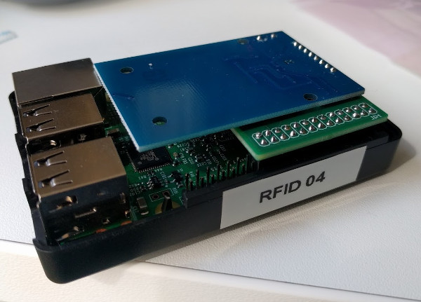

# Nerves.IO.RC522

[](https://travis-ci.org/zotonic/zotonic)

Nerves support for the RC522 RFID reader.

The RC522 is a
[cheap](http://www.banggood.com/RC522-Chip-IC-Card-Induction-Module-RFID-Reader-p-81067.html)
RFID module which can be used to read MIFARE-compatible tags at
13.56Mhz.

Combined with a Raspberry Pi, this makes for a pretty compact RFID
reader. The RC522 board is so small it easily fits inside most
raspberry pi cases.




## Limitations

Currently, only Raspberry PI is supported as the host platform due to
the usage of the [BCM2835](http://www.airspayce.com/mikem/bcm2835/)
library in the Port driver.

Furthermore, this library currently only reads the tag UID. The RC522
supports reading and writing MIFARE tag data, but this library does
not yet support it.


## Installation

  1. Add `nerves_io_rc522` to your list of dependencies in `mix.exs`:

    ```elixir
    def deps do
      [{:nerves_io_rc522, "~> 0.1.0"}]
    end
    ```

  2. Ensure `nerves_io_rc522` is started before your application:

    ```elixir
    def application do
      [applications: [:nerves_io_rc522]]
    end
    ```

## Usage

Add the `Nerves.IO.RC522` GenServer to your supervision tree:

    {Nerves.IO.RC522, [{RfidReader.Handler, :tag_scanned}]}

When a tag is scanned the function `RfidReader.Handler.tag_scanned()`
function will now be called with the hex-encoded serial number (UID)
of the scanned tag as its single argument.

## Connecting the hardware

Connecting RC522 module to SPI is pretty easy. You can use
[this neat website](http://pi.gadgetoid.com/pinout) for reference.

| Board pin name | Board pin | Physical RPi pin | RPi pin name |
|----------------|-----------|------------------|--------------|
| SDA            | 1         | 24               | GPIO8, CE0   |
| SCK            | 2         | 23               | GPIO11, SCKL |
| MOSI           | 3         | 19               | GPIO10, MOSI |
| MISO           | 4         | 21               | GPIO9, MISO  |
| GND            | 6         | 6, 9, 20, 25     | Ground       |
| RST            | 7         | 22               | GPIO25       |
| 3.3V           | 8         | 1                | 3V3          |


## License

The Elixir code of this library is distributed under the Apache
license.

The files in the `src` directory contain the `rc522` port driver,
which is distributed as GPLv2, as it incorporates the
[BCM2835](http://www.airspayce.com/mikem/bcm2835/) driver library. See
`src/COPYING` for the GPL license.
